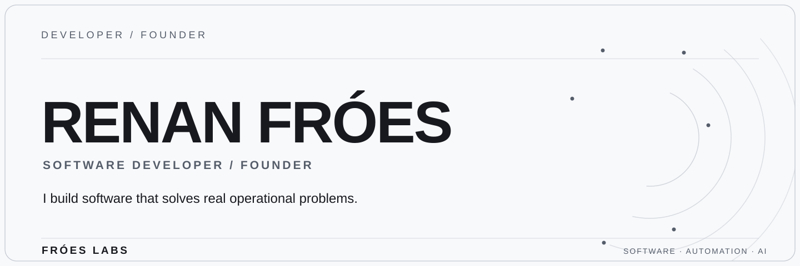

<picture>
  <source media="(max-width: 640px) and (prefers-color-scheme: dark)" srcset="./assets/hero-dark-mobile.svg">
  <source media="(max-width: 640px) and (prefers-color-scheme: light)" srcset="./assets/hero-light-mobile.svg">
  <source media="(prefers-color-scheme: dark)" srcset="./assets/hero-dark-desktop.svg">
  <source media="(prefers-color-scheme: light)" srcset="./assets/hero-light-desktop.svg">
  
</picture>

 

 &nbsp;  &nbsp;  &nbsp; 

FULL STACK DEVELOPMENT · BUSINESS SOFTWARE · AUTOMATION · APPLIED AI

 

<strong>01 / CONTRIBUTION ACTIVITY</strong>

 

LAST 12 MONTHS

  

 

---

<strong>02 / ABOUT</strong>

I'm **Renan Fróes**, a Software Developer and Founder of **Fróes Labs**.

I design and build complete software solutions — from the interface to backend, databases, infrastructure and integrations. My focus is turning real operational problems into reliable digital products.

`FULL STACK` &nbsp; `BACKEND` &nbsp; `AUTOMATION` &nbsp; `AI`

 

---

<strong>03 / TECHNOLOGIES</strong>

 

<strong>MAIN STACK</strong>

 

  
  &nbsp;&nbsp;&nbsp;
  
  &nbsp;&nbsp;&nbsp;
  
  &nbsp;&nbsp;&nbsp;
  
  &nbsp;&nbsp;&nbsp;
  

JavaScript  ·  TypeScript  ·  React  ·  Node.js  ·  PostgreSQL

  

<strong>FRONTEND & MOBILE</strong>

 

  
  &nbsp;&nbsp;&nbsp;
  
  &nbsp;&nbsp;&nbsp;
  
  &nbsp;&nbsp;&nbsp;
  
  &nbsp;&nbsp;&nbsp;
  
  &nbsp;&nbsp;&nbsp;
  

React Native  ·  Next.js  ·  Angular  ·  Tailwind CSS  ·  HTML  ·  CSS

  

<strong>BACKEND & DATA</strong>

 

  
  &nbsp;&nbsp;&nbsp;
  
  &nbsp;&nbsp;&nbsp;
  
  &nbsp;&nbsp;&nbsp;
  

Node.js  ·  Express  ·  PostgreSQL  ·  Neon

 

Also working with REST APIs and backend integrations.

  

<strong>AUTOMATION & AI</strong>

 

  
  &nbsp;&nbsp;&nbsp;
  
  &nbsp;&nbsp;&nbsp;
  

Gemini  ·  OpenRouter  ·  WhatsApp

 

Also working with OCR, automation routines and AI integrations.

  

<strong>TOOLS & INFRASTRUCTURE</strong>

 

  
  &nbsp;&nbsp;&nbsp;
  
  &nbsp;&nbsp;&nbsp;
  
  &nbsp;&nbsp;&nbsp;
  
  &nbsp;&nbsp;&nbsp;
  

Git  ·  GitHub  ·  Linux  ·  Vercel  ·  Render

  

 

---

<strong>04 / SELECTED WORK</strong>

<strong>School Cafeteria Management System</strong>

A **production system used daily** for operational and financial management in a school cafeteria. Includes sales, customer balances, billing, reports, WhatsApp communication and OCR-assisted processing of handwritten records.

`React` · `Node.js` · `PostgreSQL` · `WhatsApp` · `OCR` · `AI integrations`

 

<strong>Fróes Labs Command Center</strong>

An internal operations dashboard unifying application health, Linux server monitoring, commercial email, WhatsApp operations and Telegram alerts. Built for reliable operational visibility.

`TypeScript` · `Node.js` · `Linux` · `Automation` · `Integrations`

 

<strong>Energy Management</strong>

A system for tracking electricity usage across independent meters, with monthly readings, consumption history, authentication and administrative reports.

`React` · `Node.js` · `PostgreSQL` · `Neon` · `Vercel`

 

<strong>Developer Portfolio</strong>

My personal portfolio showcasing projects and software development work, built with Angular and TypeScript.

`Angular` · `TypeScript` · `SSR` · `Vercel` · [View project →](https://devrenanfroes.vercel.app/)

 

---

<strong>05 / FRÓES LABS</strong>

**Software · Automation · Artificial Intelligence**

At **Fróes Labs**, I build tailored software, digital products and workflow automations that help businesses solve practical problems.

[**Explore Fróes Labs →**](https://froeslabs.com/)

 

---

<strong>06 / EDUCATION</strong>

**Software Engineering** · Bachelor's Degree — UniCesumar  
**Mobile Development** · React Native Technical Program — SENAI / SC Tech

 

---

<strong>07 / CONNECT</strong>

[**Fróes Labs**](https://froeslabs.com/) &nbsp; · &nbsp; [**LinkedIn**](https://www.linkedin.com/in/devrenanfroes) &nbsp; · &nbsp; [**Portfolio**](https://devrenanfroes.vercel.app/) &nbsp; · &nbsp; [**Email**](mailto:contato@froeslabs.com)

 

RENAN FRÓES · SOFTWARE DEVELOPER & FOUNDER

<!-- profile-render-refresh: 20260920-2106-r3 -->
